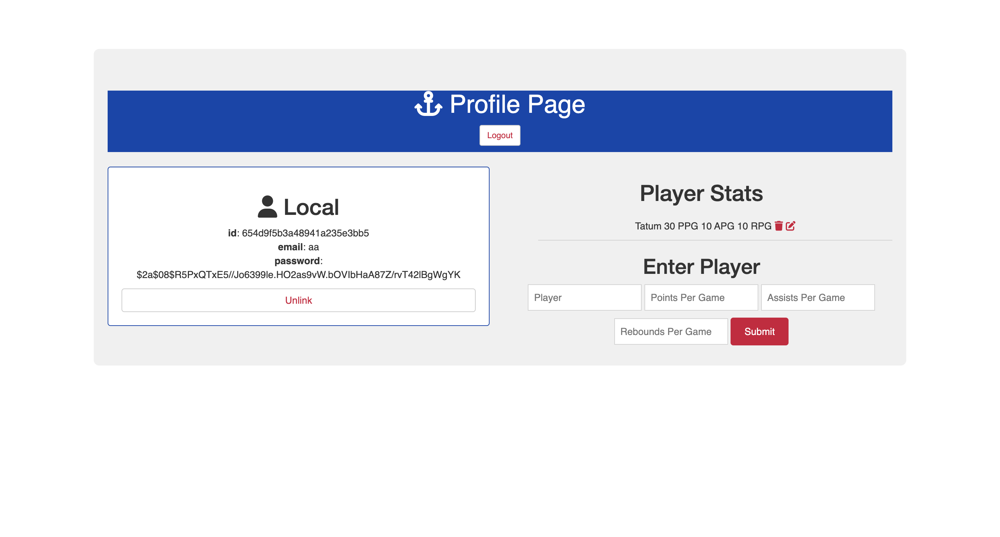

# 🏀 NBA Stats Tracker

**Goal:** Develop a full-stack NBA stats tracking application with user authentication. Users can enter, edit, and delete NBA players' stats, including points, assists, and rebounds. The app leverages MongoDB for data storage and EJS for server-side rendering.

## Project Introduction

The NBA Stats Tracker is a dedicated platform for basketball fans to keep up with their favorite players' performances. Users can securely log in to input new stats, make edits to existing data, or remove stats, ensuring the information remains current and accurate.

## Technology Stack 🛠️

**Used Technologies:** Node.js, Express.js, MongoDB, Mongoose, EJS, CSS, JavaScript

### Detailed Breakdown:

- **EJS (Embedded JavaScript):** Handles dynamic rendering of HTML pages, enabling interactive stat tracking and user-specific views.
  
- **Node.js & Express.js:** Serve as the backbone for server-side functionalities, including user authentication, data processing, and request routing.
  
- **MongoDB with Mongoose:** Provides a robust and scalable database solution for storing and managing player stats and user information.
  
- **CSS & JavaScript:** Deliver a responsive and engaging user interface, ensuring smooth interaction and real-time updates.

## Core Features 🔍

1. **User Authentication:** Secure login system, ensuring personalized and protected user experiences.
2. **Stat Management:** Users can input, edit, and delete player stats such as points, assists, and rebounds.
3. **Real-time Data Interaction:** Leveraging AJAX for asynchronous updates, enabling users to edit or delete stats without page reloads.

## Challenges & Resolutions 🌟

- Implementing a seamless flow for adding, editing, and deleting stats was a significant challenge, overcome by meticulous design of the server-side logic and efficient database operations.

## Lessons Learned 📘

- Gained extensive experience in full-stack development, from user authentication to complex database interactions.
- Deepened understanding of how to use EJS for dynamic content rendering, creating a more interactive user experience.
- Learned the importance of thorough testing in applications handling frequent data modifications.

